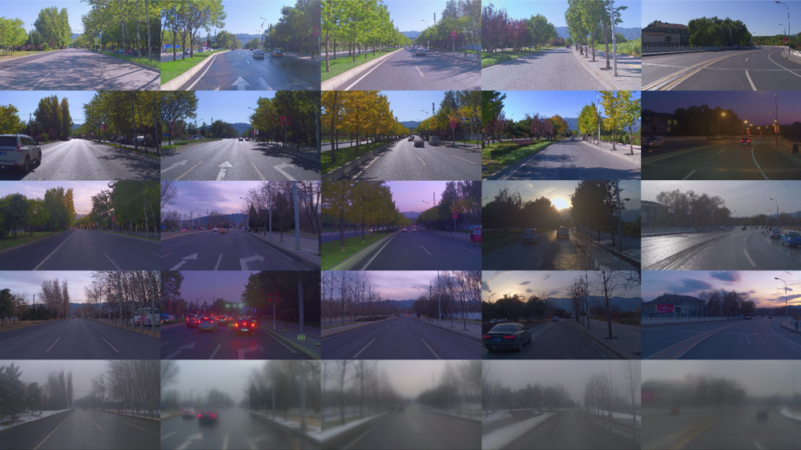
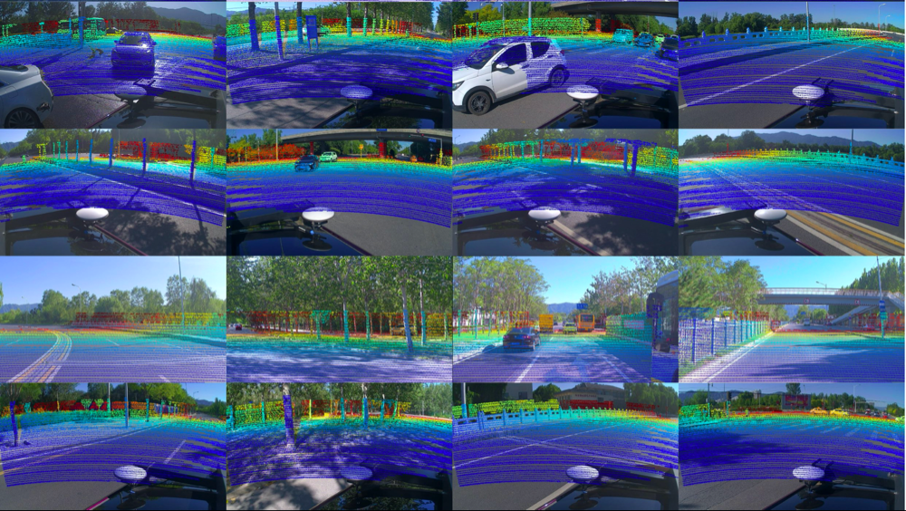

# apollo_daoxianglake_demo

## introduction
apollo_daoxianglake_demo. 

The Apollo-DaoxiangLake dataset contains 8 trials of repetitive data within 14 weeks over the same road. In particular, the dataset includes different times of the day, for example, noon, afternoon, sunset, and seasonal changes, e.g., sunny, snowy days. The dataset contains 3D LiDAR point clouds (with motion compensation), images, IMU datas and post-processing ground truth poses in a local coordinate system. The camera images in the datasets are shown to demonstrate the coverage diversity of our datasets.



Dataset Structure
The Apollo-DaoxiangLake dataset provides six folders.

pcd_data: The point clouds are captured by Velodyne HDL-64E LiDAR.

image_data: The RGB images are captured by three rolling shutter cameras. The shutter speed of each camera is 45.56ms.

imu_data: The raw imu data (timestamp,acc_x,acc_y,acc_z,w_x,w_y,w_z) captured by fiber optic gyro and MEMS accelerometer.

gt_pose_data: The poses (x,y,z,qx,qy,qz,qw) of the vechicle in a local coordinate system.
params: The extrinsic and intrinsic parameters of the sensors.

split: The training and testing data split.

```
pcd_data
  └───20190918143332
  │  pcd_stamps.txt
  │   name_1.pcd
  │   name_2.pcd
  │   name_3.pcd
  │   ...
  └───20190924124848
  │  pcd_stamps.txt
  │   name_1.pcd
  │   name_2.pcd
  │   name_3.pcd
  │   ...
  │  ...

image_data
  └───20190918143332
  │    └───front
  │    │  image_stamps.txt
  │    │  name_1.jpg
  │    │  name_2.jpg
  │    │  name_3.jpg
  │    │  ...
  │    └───left_back
  │    │  image_stamps.txt
  │    │  name_1.jpg
  │    │  name_2.jpg
  │    │  name_3.jpg
  │    │  ...
  │    └───right_back
  │    │  image_stamps.txt
  │    │  name_1.jpg
  │    │  name_2.jpg
  │    │  name_3.jpg
  │    │  ...
  │  ...
imu_data
  └───20190918143332
  │    rawimu.txt
  └───20190924124848
  │    rawimu.txt
  │  ...

gt_pose_data
  └───20190918143332
  │    vechicle_poses.txt
  └───20190924124848
  │    vechicle_poses.txt
  │    ...

 params
  |    pcd_extrinsic.yaml
  |    front_camera_extrinsic.yaml
  |    front_camera_intrinsic.yaml
  |    ...

 split
  |    train_split.txt
  |    test_split.txt
```

Demo Code For Using Data
1. The PCD File Format
The pcd files in the dataset use a self-defined PCD file format header.

Here is the demo code to load pcd file.

```
/**@brief register the format header of PCD file of dataset into PCL. */
struct PointXYZIT {
    float x;
    float y;
    float z;
    unsigned char intensity;
    double timestamp;
    EIGEN_MAKE_ALIGNED_OPERATOR_NEW 
} EIGEN_ALIGN16;

POINT_CLOUD_REGISTER_POINT_STRUCT (PointXYZIT,
                                    (float, x, x)
                                    (float, y, y)
                                    (float, z, z)
                                    (uint8_t, intensity, intensity)
                                    (double, timestamp, timestamp)
                                    )
    
/**@brief load pcd file.
    * @param  <pose_file_path> path of pcd file.
    * @param  <cloud> a PointXYZIT type pointer to store the content of PCD file.
    */
bool load_pcd_file(
        const std::string& load_pcd_path, 
        pcl::PointCloud <PointXYZIT>::Ptr cloud) {
    if (pcl::io::loadPCDFile(load_pcd_path.c_str(), *cloud) != 0) {
        std::cerr  < < "Can't load pcd file from "  < < load_pcd_path  < < std::endl;   
        return false;            
    }    
    return true;
}          
```

2. Point Cloud Projection
Here is a C++ style pseudo code to project the point clouds onto the image with rolling shutter compensation.

```
/**@brief project point cloud onto image with rolling shutter.
    * @param <timestamp> timestamp of the image.
    * @param <cam_intrinsic> intrinsic of the camera.
    * @param <cloud> 3D coords of point cloud.
    * @param <pixels> corresponding pixel coords on image.
*/
const double shutter_time = 45.56 * 1e-3;
void project_rolling_shutter(
    const double ×tamp, const CameraIntrinsics &cam_intrinsic,
    const std::vector<Eigen::Vector3d> &cloud, std::vector<ImagePixel> *pixels) {
    project_global_shutter(timestamp, cam_intrinsic, cloud, pixels);

    uint32_t height = cam_intrinsic.height;
        uint32_t width = cam_intrinsic.width;

    // Generate cloud2camera transformation per image line
    double last_timestamp = timestamp;
    double first_timestamp = last_timestamp - shutter_time;
    double stamp_stride = (last_timestamp - first_timestamp) / height;
	std::vector<Eigen::Affine3d> cloud2camera_array(height);
    for (uint32_t idx = 0; idx < height; ++idx) {
        double cur_stamp = first_timestamp + stamp_stride * (idx + 0.5);
        get_cloud2camera(cur_stamp, &cloud2camera_array[idx]);
    }

    // Iterative projection
    const int itr_num = 2;
    for (int itr = 0; itr < itr_num; ++itr) {
        for (size_t idx = 0; idx < cloud.size(); ++idx) {
            auto &pix = (*pixels)[idx];

            // Use pose from current image line
            int row = pix.y;
            if (row < 0) {row = 0;}
            if (row > height - 1) {row = height - 1;}
            const Eigen::Vector3d pt3d_cam = cloud2camera_array[row] * cloud[idx];

            if (pt3d_camΐ] > 1e-3) {
                project_3d_2d(cam_intrinsic, pt3d_cam, &pix);
            }
        }
    }
}
```

Here is the projection results.



ref:https://developer.apollo.auto/daoxianglake.html

## How to build 
```
cd apollo_daoxianglake_demo

./build_and_run.sh
```
## More help

https://developer.apollo.auto/daoxianglake.html

